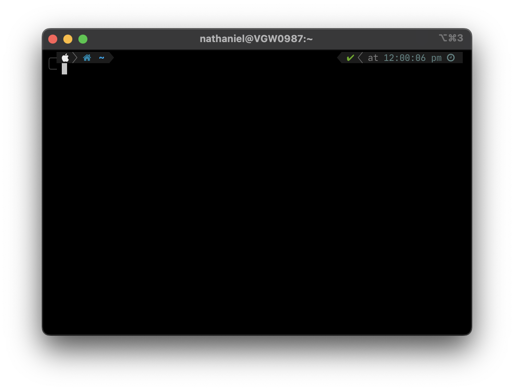
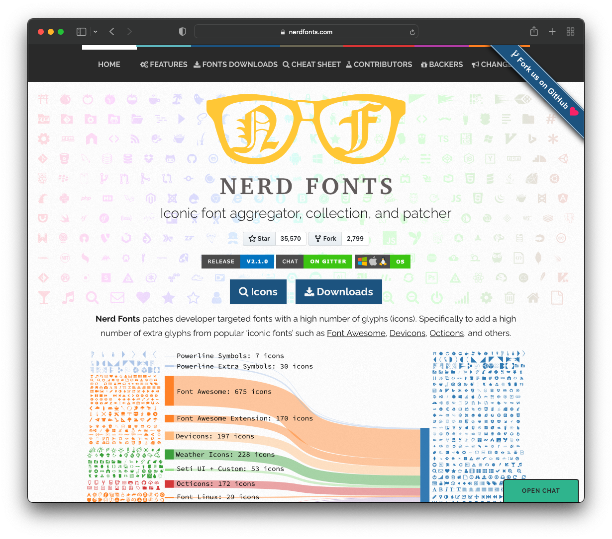

# Terminal Tools
This section technically is applicale to any Unix based terminal. There will be options of MacOS and Linux (Ubuntu) in this section as you go through.

## Zsh
Zsh is installed by default after after Catalina but is very powerful compared to bash. Zsh also called the Z shell, is an extended version of the Bourne Shell (sh), with plenty of new features, and support for plugins and themes. Since it’s based on the same shell as Bash, ZSH has many of the same features, and switching over is a breeze.

***Install***

=== "Linux"
    ```bash
    sudo apt install zsh
    ```

## Oh My Zsh!
Oh My Zsh is an open source, community-driven framework for managing your zsh configuration.

Sounds boring. Let's try again.

Oh My Zsh will not make you a 10x developer...but you may feel like one.

Once installed, your terminal shell will become the talk of the town or your money back! With each keystroke in your command prompt, you'll take advantage of the hundreds of powerful plugins and beautiful themes. Strangers will come up to you in cafés and ask you, "that is amazing! are you some sort of genius?"

^ Ripped Directly from their GitHub Page

***Install***

=== "curl"
    ```bash
    sh -c "$(curl -fsSL https://raw.githubusercontent.com/ohmyzsh/ohmyzsh/master/tools/install.sh)"
    ```
=== "wget"
    ```bash
    sh -c "$(wget -O- https://raw.githubusercontent.com/ohmyzsh/ohmyzsh/master/tools/install.sh)"
    ```
=== "fetch"
    ```bash
    sh -c "$(fetch -o - https://raw.githubusercontent.com/ohmyzsh/ohmyzsh/master/tools/install.sh)"
    ```

***Links***

- [Github](https://github.com/ohmyzsh/ohmyzsh)

## Powerlevel10k
Presuming you setup the above Oh My Zsh! You should install a theme, my favorite of which being Powerlevel10k. Power 10k I think just makes the terminal much nicer to use.



To take advantage fully of Powerlevel10k you should install a version of [Nerd Fonts](https://www.nerdfonts.com/) which has an assortment of images in the font to make the terminal easier to use at a glance.



**Install**

```bash
git clone --depth=1 https://github.com/romkatv/powerlevel10k.git ${ZSH_CUSTOM:-$HOME/.oh-my-zsh/custom}/themes/powerlevel10k
```

**Links**

- [PowerLevel10k Github](https://github.com/romkatv/powerlevel10k)
- [Nerd Fonts](https://www.nerdfonts.com/)