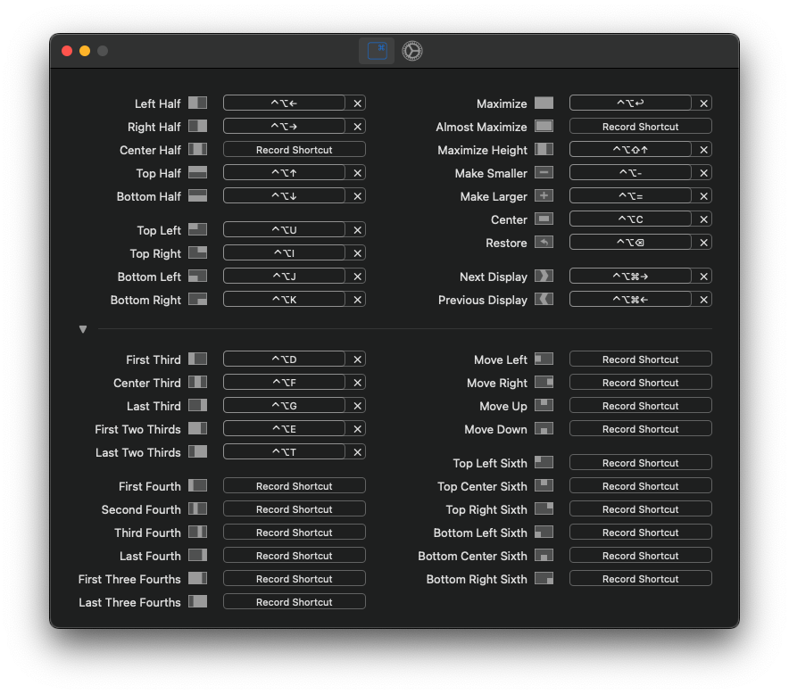
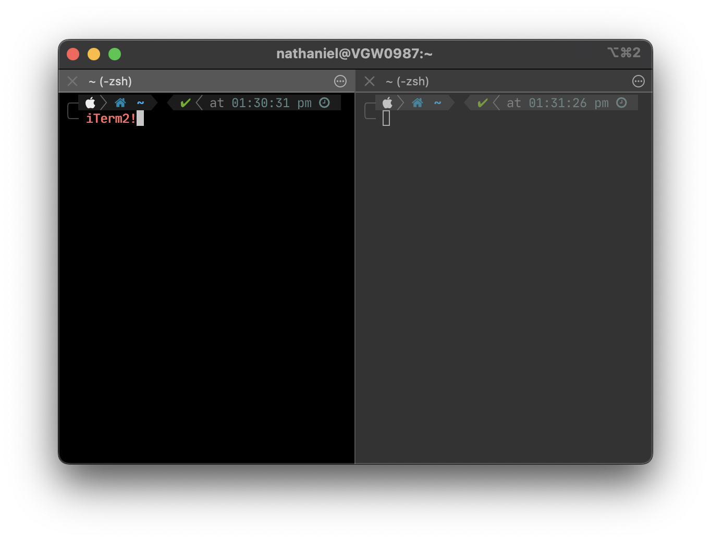

# Useful Tools for a New Mac User
To those like I when you first moved to Mac from a lifetime of using Windows, it was a lot. The following is some of my favorite tools and how to use them since I moved to Mac.

## Rectagles
The worst thing about moving to Mac from Windows is the pure lack of window snapping in MacOS, even the majority of major Linux Distro's have window snapping Apple.... Either way the best window snapping tool I have found so far is Rectangles, and [Rxhanson](https://github.com/rxhanson) has done one hell of a job.

Rectangles is a very powerful yet simple tool that bring what I feel is very Windows, window snapping to Mac.


**Links**

  - [RectangleApp.com](https://rectangleapp.com/)
  - [Github Rectangles](https://github.com/rxhanson/Rectangle)

**Install**
```bash
brew install --cask rectangle
```

## iTerm2
The base terminal too boring? Not powerful enough or the most important question, is it lacking tiling? If any of the previous questions are applicable to you then what you need is iTerm2. The keep it simple stupid approach to your terminal.


**Links**

- [iTerm2 Website](https://iterm2.com/)

**Install**
```bash
brew install --cask iterm2
```

